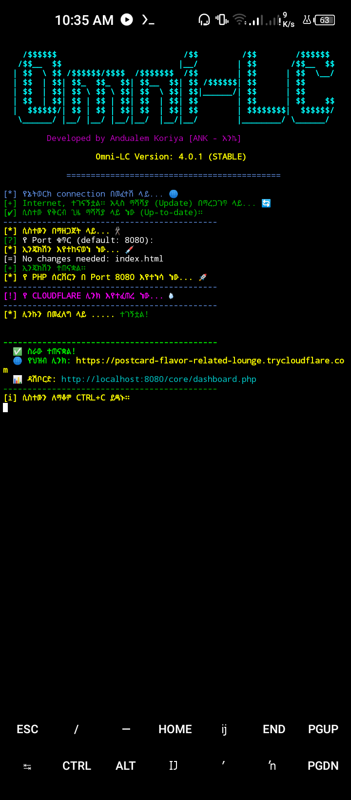
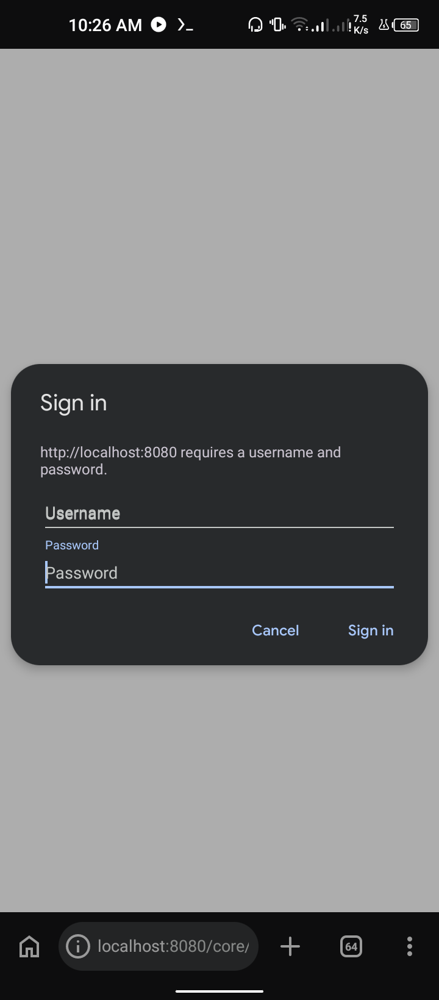
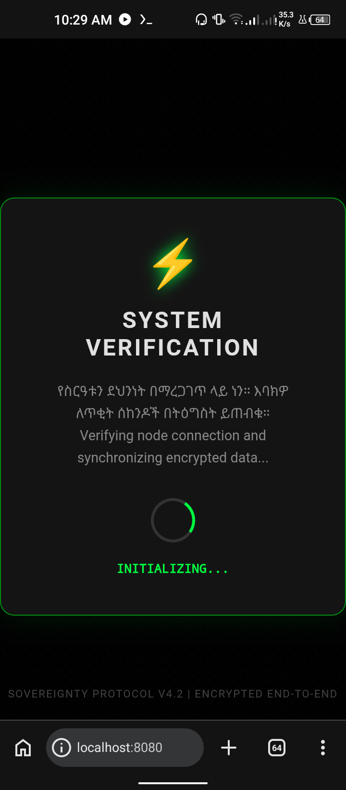
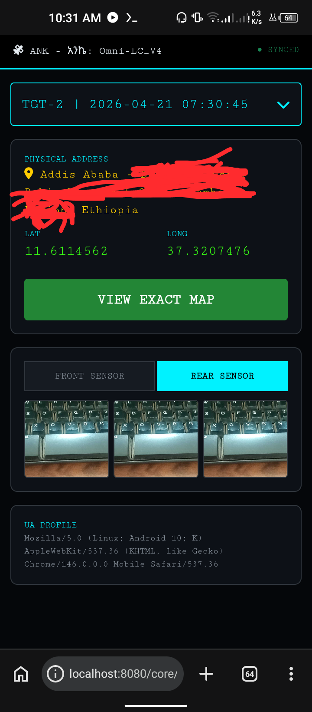

# Omni-LC (Location & Camera OSINT Tool) 🛰️📸

**Omni-LC** is a next-generation OSINT and security research tool. It demonstrates automated geolocation tracking and synchronized camera capture, managed through a real-time encrypted dashboard.

<p align="center">
  
  <br>
  <i>Omni-LC Terminal Interface in Termux</i>
</p>
---

## 🚀 Key Features
* **📍 Precision Geolocation:** Real-time GPS coordinate acquisition.
* **📸 Dual-Camera Sync:** Automated front and back camera image capture.
* **📊 Live Dashboard:** Secure PHP-based monitoring for logs and media.
* **☁️ Cloudflare Tunneling:** Instant public access without port forwarding.
* **🔄 Auto-Update:** Built-in engine to keep the tool synchronized with the latest GitHub version.

---

## 🔐 Dashboard Access
The dashboard is protected with a security gate. Use the following credentials to log in:

| Feature | Credential |
| :--- | :--- |
| **Username** | `ank` |
| **Password** | `ank` |

<p align="center">
  
</p>

---

## 📸 Visual Overview

### Target Home Page
When the target opens the link, the system performs an encrypted handshake.
<p align="center">
  
 </p>

### Live Monitoring Dashboard
Track location, address, and captured images in real-time.
<p align="center">
  
</p>

---

## 📋 Prerequisites & Requirements

This tool requires specific packages to be installed before running. If you are using **Termux**, run the following command to set up the environment:

```bash
pkg update && pkg upgrade -y
pkg install php python git cloudflared termux-api -y
```

**Note:** For `termux-open-url` to work properly, you must have the **Termux:API** app installed from F-Droid or Play Store.

---

## 📥 Installation & Usage

1. **Clone the repository:**
   ```bash
   git clone https://github.com/ANK-369/Omni-LC.git
   cd Omni-LC
   ```

2. **Run the tool:**
   ```bash
   chmod +x run.sh
   ./run.sh
   ```
   Or
   ```
   chmod +x run.sh
   bash run.sh
   ```

4. **Deployment:**
   * **Target Link:** Send the `trycloudflare.com` link to the target.
   * **Monitor Link:** Use the `localhost` dashboard link to view results.

---

## ⚠️ Known Limitations (Important)
* **Internet Connection:** `cloudflared` requires an active internet connection to generate a public link.
* **Location Permissions:** Modern browsers strictly enforce permission policies. If a user **Blocks** the location prompt, it cannot be triggered again automatically.

---

## 🛡️ Disclaimer
**For Educational Purposes Only.** This tool was developed by **ANK-369** to explore cybersecurity concepts and OSINT methodologies. Unauthorized use on devices without explicit consent is illegal. The developer is not responsible for any misuse.

---

## 👨‍💻 About the Developer
**አንኬ | ANK (ANK-369)**
*Cybersecurity Student | OSINT Enthusiast | Ethiopian Air Force*
> "Building intelligent security systems for a digital world."
